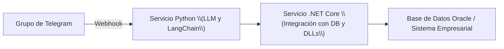

```mermaid
flowchart LR
    A[Grupo de Telegram] -->|Webhook| B["Servicio Python \\(LLM y LangChain\\)"]
    B --> C["Servicio .NET Core \\(Integración con DB y DLLs\\)"]
    C --> D["Base de Datos Oracle / Sistema Empresarial"]
```